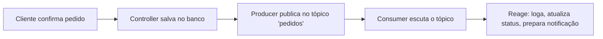

# Cardápio Digital

> **Projeto de estudo** — construído para aprender e praticar, na prática, um conjunto específico de tecnologias e conceitos (listados abaixo). O produto em si (um cardápio digital) é o veículo; o objetivo real é o aprendizado.

Sistema de cardápio digital genérico (hamburgueria, açaiteria, pizzaria, etc.) para portfólio. Lojista cadastra categorias, produtos e grupos de complementos; cliente navega, monta o pedido e envia — sem pagamento online, combinado à parte na entrega/retirada.

## Objetivos de aprendizado

Este projeto foi desenhado especificamente para praticar:

- **Mensageria com Kafka** — desacoplar o fluxo de criação de pedido usando producer/consumer, entender tópicos, consumer groups e (mais adiante) confiabilidade de entrega (dual write problem, idempotência)
- **Docker** — subir e orquestrar serviços locais (MySQL + Kafka) via `docker-compose`, sem depender de instalação nativa na máquina
- **SOLID / Clean Code** — aplicar os 5 princípios na prática: Services isolados (`PricingService`), Repository Pattern com interfaces (Dependency Inversion), Controllers enxutos que só orquestram
- **Laravel "puro"** — Blade + Ajax, sem framework JS (Vue/React), pra fixar fundamentos antes de adicionar complexidade de front
- **Modelagem de domínio flexível** — catálogo genérico (categorias → produtos → grupos de complementos reutilizáveis), em vez de hardcoded para um único nicho
- **Multi-tenancy** *(previsto)* — evoluir de loja única para várias lojas na mesma instância: escopo por tenant, isolamento de dados e resolução da loja a partir da request
- *(Opcional, se sobrar tempo)* **WebSocket/Reverb** — broadcasting em tempo real como extensão do que o Kafka já desacoplou

## Funcionalidades

**Área pública (cliente)**
- Catálogo por categorias, com busca
- Detalhe do produto com grupos de complementos (obrigatórios e opcionais, com mín/máx de seleção)
- Carrinho com cupom de desconto
- Checkout sem cadastro formal — identificação do cliente por telefone
- Confirmação de pedido

**Painel do lojista (admin)**
- Login
- Visão geral (métricas do dia)
- Pedidos em kanban (recebido → preparo → pronto → entregue)
- Gestão de categorias e produtos
- Configurações da loja (horário, endereço, taxa de entrega)

## Stack

- **Backend:** Laravel + Blade + Ajax (sem framework JS)
- **Autenticação:** Laravel Breeze
- **Mensageria:** Kafka (via `junges/laravel-kafka`), rodando localmente via Docker
- **Tempo real (opcional/futuro):** Laravel Reverb
- **Banco:** MySQL (via Docker)
- **Qualidade de código:** Laravel Pint

## Decisões de escopo (e por quê)

- **Sem pagamento online.** Pagamento é combinado na entrega/retirada (Pix, dinheiro ou cartão na maquininha), como funciona a maioria dos cardápios digitais do mercado. Evita a complexidade de lidar com dados de cartão sem necessidade real pro caso de uso — e mantém o foco nos objetivos de aprendizado acima, não em integração de pagamento.
- **Sem cadastro obrigatório do cliente.** Reduz fricção no pedido. O cliente é identificado pelo telefone no checkout, o que já viabiliza histórico de pedidos e abre espaço para fidelização futura, sem exigir login.
- **Sem WebSocket no MVP.** O dashboard de pedidos atualiza via polling (Ajax a cada 10-15s). Reverb/WebSocket fica como extensão opcional — ver [Roadmap](#roadmap).

## Arquitetura: onde o Kafka entra



O Kafka desacopla o que acontece depois que um pedido é criado — outras partes do sistema podem reagir ao evento sem o Controller precisar conhecer cada uma delas. É o ponto central de estudo de mensageria neste projeto.

## Boas práticas de código

- **SOLID** aplicado nas camadas de serviço (`PricingService` isolado do cálculo de preço) e acesso a dados (Repository Pattern com interface, seguindo Dependency Inversion)
- Controllers enxutos — apenas orquestram, sem lógica de negócio
- Formatação padronizada com `laravel/pint`

## Modelagem do banco

`lojas` · `categorias` · `produtos` · `grupos_complementos` · `opcoes_complemento` · `produto_grupo` (pivot) · `clientes` · `pedidos` · `itens_pedido` · `item_pedido_opcoes` · `cupons` (opcional)

## Como rodar localmente

```bash
git clone <repo>
cd cardapio
composer install
cp .env.example .env
php artisan key:generate

docker-compose up -d   # MySQL + Kafka

php artisan migrate --seed
php artisan serve
```

## Multi-tenancy (previsto)

Hoje o sistema roda como **loja única**. A evolução planejada é torná-lo multi-tenant: várias lojas na mesma instância, cada uma com seu próprio catálogo, pedidos, cupons e configurações, isoladas entre si.

A modelagem já foi desenhada com isso em mente — `lojas` é a tabela âncora, e as demais entidades do catálogo pendem dela. O que ainda precisa ser decidido e implementado:

- **Estratégia de isolamento** — banco compartilhado com `loja_id` + global scope no Eloquent, ou um banco por tenant
- **Resolução do tenant** — subdomínio (`loja.dominio.com`), domínio próprio ou slug na URL (`/loja/hamburgueria-hut`)
- **Escopo automático nas queries** — garantir que nenhuma consulta vaze dados entre lojas, inclusive nos jobs e consumers do Kafka
- **Isolamento de storage** — imagens de produto e banner separados por loja
- **Particionamento das mensagens** — usar a loja como chave de partição no Kafka, para preservar a ordem dos eventos por tenant

Até lá, todo o código assume uma única loja.

## Roadmap

- [ ] Multi-tenancy (múltiplas lojas na mesma plataforma) — ver [Multi-tenancy (previsto)](#multi-tenancy-previsto)
- [ ] Reverb/WebSocket para o dashboard atualizar em tempo real
- [ ] Cupons e promoções
- [ ] Confiabilidade de mensageria (Transactional Outbox, idempotência de consumer)
- [ ] Deploy (Railway/Render)

## Screenshots

