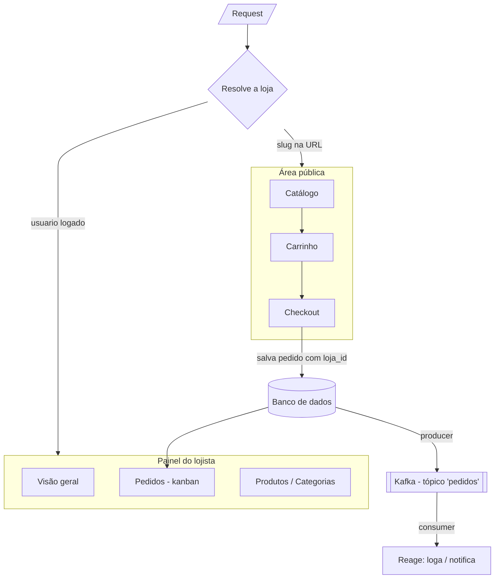
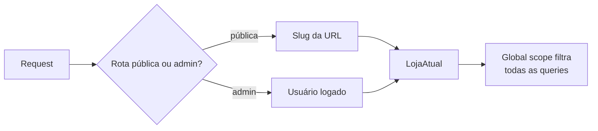
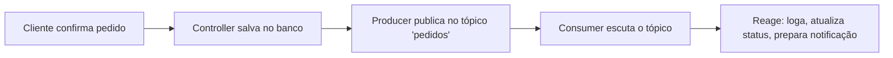

# Cardápio — resumo, estudos e TODO

Última atualização: 22 de setembro de 2026

Sistema de cardápio digital genérico (estilo Cardápio Web) — catálogo público pro cliente pedir, painel admin pro lojista gerenciar. Sem pagamento online. Projeto de portfólio: foco em aplicar SOLID, mensageria (Kafka) e multi-tenancy na prática.

## Tecnologias

**Base:** Laravel (PHP) + Blade + Ajax (sem framework JS) · MySQL · Docker (só pra rodar MySQL + Kafka localmente)

**Pacotes Laravel a instalar**

| Pacote | Pra quê |
| --- | --- |
| laravel/breeze | Login do lojista |
| junges/laravel-kafka | Publicar/consumir eventos no Kafka |
| laravel/reverb | WebSocket (opcional, fase 2) |
| intervention/image | Redimensionar fotos de produto |
| laravel/pint | Padronizar formatação do código |
| barryvdh/laravel-debugbar | Debug local (dev only) |

**Multi-tenancy: sem pacote.** Existem `stancl/tenancy` e `spatie/laravel-multitenancy`, mas pro modelo de banco compartilhado o que você precisa são ~40 linhas (um middleware + uma trait com global scope). Fazer à mão é justamente o ponto de aprendizado — pacote esconde exatamente a parte que interessa estudar.

## Arquitetura geral



## Status — visão macro

- [ ]  Setup do projeto
- [ ]  Banco de dados e Models
- [ ]  Autenticação do admin
- [ ]  CRUD (categorias, produtos, complementos)
- [ ]  Área pública (catálogo → checkout)
- [ ]  Fluxo de pedido funcionando sem Kafka
- [ ]  Kafka (publish + consume)
- [ ]  Dashboard admin
- [ ]  Multi-tenancy (escopo por loja)
- [ ]  Passada de SOLID
- [ ]  Testes + polimento

---

# SOLID aplicado neste projeto

*Quando estudar: fases 1 a 4 do TODO — desde o primeiro Service/Repository que você escrever.*

Não é teoria abstrata — são 5 decisões de organização de código, com o exemplo exato de onde cada uma aparece no seu cardápio.

**S — Single Responsibility (uma responsabilidade por classe)**

Errado: o `PedidoController` calcula preço, salva no banco, publica no Kafka e formata a resposta, tudo junto.

Certo: separar em `PricingService` (só calcula preço) e `PedidoService` (só orquestra a criação do pedido).

```php
class PricingService {
    public function calcularTotal(Produto $produto, array $opcoesEscolhidas, int $qtd): float {
        $total = $produto->preco_base;
        foreach ($opcoesEscolhidas as $opcao) {
            $total += $opcao->preco_adicional;
        }
        return $total * $qtd;
    }
}
```

**O — Open/Closed (aberto pra extensão, fechado pra modificação)**

Se amanhã você quiser um novo tipo de desconto, não deveria precisar reescrever o `PricingService` inteiro — só adicionar uma nova classe.

**L — Liskov Substitution**

Se você criar `DescontoPercentual` e `DescontoValorFixo`, qualquer um deve poder ser usado no lugar do outro sem quebrar nada — ambos implementam a mesma interface `Desconto` com o mesmo método `aplicar()`.

**I — Interface Segregation**

Não crie uma interface gigante `ProdutoServiceInterface` com 15 métodos. Prefira interfaces pequenas: `CalculaPreco`, `ValidaEstoque`.

**D — Dependency Inversion**

O Controller depende de uma interface `ProdutoRepositoryInterface`, não da implementação direta.

```php
interface ProdutoRepositoryInterface {
    public function buscarPorCategoria(int $categoriaId): Collection;
}

class EloquentProdutoRepository implements ProdutoRepositoryInterface {
    public function buscarPorCategoria(int $categoriaId): Collection {
        return Produto::where('categoria_id', $categoriaId)->get();
    }
}
```

**Resumo prático:**

| Camada | Padrão |
| --- | --- |
| Cálculo de preço | Service isolado (`PricingService`) |
| Acesso a dados | Repository + Interface |
| Descontos/cupons | Strategy Pattern |
| Contexto da loja | Singleton no container (`LojaAtual`) injetado, não `static` global |
| Controllers | Só orquestram, sem lógica de negócio |

---

# Multi-tenancy

*Quando estudar: a **decisão de modelagem** entra já na fase 2 (é barato agora, caro depois). A **implementação** é a fase 9 — depois que admin e área pública já funcionam bem para uma loja só.*

**O que é, em uma frase:** uma instalação só do sistema atendendo várias lojas, cada uma enxergando exclusivamente os próprios dados.

## As duas estratégias

| Estratégia | Como funciona | Prós | Contras |
| --- | --- | --- | --- |
| **Banco compartilhado** | Toda tabela do domínio tem `loja_id`; um global scope filtra automaticamente | Uma migration só, simples de subir e de hospedar | Um scope esquecido vaza dados entre lojas |
| **Banco por tenant** | Cada loja tem seu próprio banco; a conexão troca a cada request | Isolamento forte por construção | Migrations × N lojas, backup e deploy bem mais complexos |

**Decisão pro projeto: banco compartilhado com `loja_id`.** É o que a maioria dos SaaS pequenos usa, cabe no escopo, e deixa o aprendizado real mais evidente — garantir que o escopo nunca vaze.

## Como resolver qual loja é a da request

| Forma | Exemplo | Quando usar |
| --- | --- | --- |
| **Slug na URL** | `/cardapio/hamburgueria-hut` | Mais simples; funciona em localhost sem configurar nada |
| Subdomínio | `hamburgueria-hut.seudominio.com` | Mais "profissional"; exige wildcard DNS |
| Domínio próprio | `hamburgueriahut.com.br` | Só faz sentido em produção |

**Decisão:** slug na URL para a área pública. No admin nem precisa resolver nada — a loja vem do usuário logado (`auth()->user()->loja_id`).



## As três peças em Laravel

**1. Um singleton que guarda a loja da request**

```php
class LojaAtual
{
    private ?Loja $loja = null;

    public function definir(Loja $loja): void { $this->loja = $loja; }
    public function get(): ?Loja { return $this->loja; }
    public function id(): ?int { return $this->loja?->id; }
}
```

Registrado no `AppServiceProvider` com `$this->app->singleton(LojaAtual::class)`. Injetar essa classe (em vez de usar uma variável global ou um `static`) é Dependency Inversion na prática — e é o que torna possível testar com duas lojas diferentes.

**2. Uma trait com o global scope**

```php
trait BelongsToTenant
{
    protected static function bootBelongsToTenant(): void
    {
        static::addGlobalScope('loja', function (Builder $query) {
            if ($lojaId = app(LojaAtual::class)->id()) {
                $query->where($query->getModel()->getTable().'.loja_id', $lojaId);
            }
        });

        static::creating(function ($model) {
            $model->loja_id ??= app(LojaAtual::class)->id();
        });
    }
}
```

**3. Um middleware que resolve a loja**

```php
public function handle(Request $request, Closure $next): Response
{
    $loja = Loja::where('slug', $request->route('loja'))->firstOrFail();
    app(LojaAtual::class)->definir($loja);

    return $next($request);
}
```

Depois é só usar `use BelongsToTenant;` em todo Model do domínio (`Categoria`, `Produto`, `Pedido`, `Cupom`…) — e as queries passam a ser filtradas sozinhas.

## As armadilhas (o aprendizado real está aqui)

- **Query que escapa do scope.** `DB::table('produtos')` e `withoutGlobalScope()` **não** são filtrados. Toda query crua precisa do `where loja_id` na mão.
- **Jobs e consumers não têm request.** O middleware não roda neles, então `LojaAtual` está vazio e o global scope não filtra nada — ou seja, o job enxerga **todas** as lojas. O `loja_id` tem que viajar no payload e ser reaplicado na primeira linha do handler.
- **Chaves de cache e de storage.** `cache()->get('cardapio')` serve o cardápio da loja errada. Prefixe sempre: `"loja:{$id}:cardapio"`. Mesma coisa pros uploads: `storage/app/public/lojas/{id}/produtos/...`.
- **Unique constraints.** O slug de uma categoria não pode ser único globalmente, senão a segunda loja não consegue criar "Lanches". Tem que ser `unique(['loja_id', 'slug'])`.
- **Seeder e factories.** Precisam criar a loja antes, senão `loja_id` fica nulo e o registro some de todas as consultas.

## Interação com o Kafka

Duas coisas, e vale já deixar prontas na fase 7 pra não ter retrabalho:

- **O evento carrega `loja_id`.** Sem isso o consumer não tem como reaplicar o contexto (ver armadilha acima).
- **A loja é a chave de partição.** `->withKey($pedido->loja_id)` garante que os eventos de uma mesma loja caem sempre na mesma partição e são processados em ordem — que é o único motivo real pra você olhar partições neste projeto.

## Como provar que não vaza

O teste mais valioso do módulo, e o que vale printar no README:

```php
it('não deixa uma loja ver os produtos da outra', function () {
    $lojaA = Loja::factory()->has(Produto::factory()->count(3))->create();
    $lojaB = Loja::factory()->has(Produto::factory()->count(2))->create();

    app(LojaAtual::class)->definir($lojaA);

    expect(Produto::count())->toBe(3);
});
```

---

# Kafka

*Quando estudar: fase 7 do TODO — só depois que catálogo, carrinho, checkout e pedido já estiverem funcionando sem Kafka.*

**O que é, em uma frase:** uma fila de mensagens. Uma parte do sistema publica uma mensagem ("pedido criado"), outras partes ficam observando e reagem, sem uma depender diretamente da outra.

**Conceitos que você precisa saber (só isso, não mais):**

| Termo | O que é |
| --- | --- |
| Tópico (topic) | O "canal" onde as mensagens são publicadas. Ex: `pedidos` |
| Producer | Quem publica a mensagem no tópico (no seu caso: o Controller, depois de salvar o pedido) |
| Consumer | Quem fica ouvindo o tópico e reage quando chega mensagem nova |
| Mensagem/Evento | O dado enviado, geralmente em JSON |

**Onde entra no seu projeto:** só em um ponto — a confirmação do pedido no checkout.



**Setup local (100% gratuito):**

```yaml
services:
  kafka:
    image: confluentinc/cp-kafka:latest
    ports:
      - "9092:9092"
```

**Pacote:** `junges/laravel-kafka`.

```php
Kafka::publish('kafka-connection')
    ->onTopic('pedidos')
    ->withBodyKey('evento', 'pedido.criado')
    ->withBodyKey('pedido_id', $pedido->id)
    ->withBodyKey('loja_id', $pedido->loja_id)
    ->send();
```

```php
Kafka::consumer(['pedidos'])
    ->withHandler(function (\Junges\Kafka\Contracts\KafkaConsumerMessage $message) {
        $dados = $message->getBody();

        // Sem isto o global scope não filtra nada e o handler enxerga todas as lojas.
        app(LojaAtual::class)->definir(Loja::findOrFail($dados['loja_id']));
    })
    ->build()
    ->consume();
```

**O que você NÃO precisa aprender agora:** replicação, consumer groups avançados, tuning de performance. (Partição você vai encostar de leve, só pra usar `loja_id` como chave — ver a seção de Multi-tenancy.)

## Confiabilidade: o que pode falhar (aprofundar quando chegar nessa parte)

**Banco salva, mas o Kafka falha ao publicar ("dual write problem")** — salvar no banco e publicar no Kafka são duas operações separadas, não atômicas.

- Solução "de produção": padrão Transactional Outbox — não é necessário pro portfólio.
- Solução pragmática: o pedido é o caminho crítico; o evento é "melhor esforço" — `try/catch` no publish, loga erro, não desfaz o pedido.

```php
try {
    Kafka::publish('kafka-connection')->onTopic('pedidos')->withBodyKey('pedido_id', $pedido->id)->send();
} catch (\Throwable $e) {
    Log::error('Falha ao publicar pedido.criado', ['pedido_id' => $pedido->id, 'erro' => $e->getMessage()]);
}
```

**Consumer desligado quando a mensagem chega** — Kafka não perde a mensagem: guarda no tópico por um período (retenção) e controla até onde cada consumer group já processou (offset).

**Consumer quebra no meio, ou mensagem duplicada** — Kafka garante "at-least-once". O handler deveria ser idempotente e ter `try/catch` interno.

---

# WebSocket / Reverb (opcional)

*Quando estudar: opcional, só se sobrar tempo depois da fase 8 — não é bloqueio pra terminar o projeto.*

**Por que fica de fora do MVP:** o único ganho real é o dashboard atualizar sozinho, sem F5. Isso pode ser resolvido com polling (Ajax perguntando a cada 10-15s) — mais simples, sem ferramenta nova.

**Se/quando for implementar:**

- `laravel/reverb` — servidor WebSocket do próprio Laravel, grátis
- No front, Laravel Echo escuta o canal:

```jsx
Echo.channel('pedidos')
    .listen('PedidoCriado', (e) => {
        // atualiza a lista sem reload
    });
```

- No backend, o evento `PedidoCriado` implementa `ShouldBroadcast`.
- **Com multi-tenancy, o canal tem que ser por loja** (`pedidos.{loja_id}`) e privado — senão um lojista recebe os pedidos do outro em tempo real.

**Quando vale a pena:** só depois que o resto do projeto estiver funcionando de ponta a ponta. Documentar como "melhoria futura" no README é uma decisão de escopo válida.

---

# TODO do projeto

Ordem sugerida — marque conforme for avançando. Não pule pro Kafka antes do passo 6 estar funcionando sem ele.

## 1. Setup

- [ ]  `laravel new cardapio`
- [ ]  Configurar `.env`
- [ ]  Subir MySQL + Kafka via `docker-compose`
- [ ]  Instalar Breeze

## 2. Banco de dados e Models

- [ ]  Migration + Model: `lojas`, `categorias`, `produtos`, `grupos_complementos`, `opcoes_complemento`, `produto_grupo` (pivot), `clientes`, `pedidos`, `itens_pedido`, `item_pedido_opcoes`
- [ ]  **Já criar `loja_id` em todas as tabelas do domínio** — adicionar depois significa migration de dados em tudo
- [ ]  **`unique` composto com `loja_id`** onde fizer sentido (slug de categoria, código de cupom)
- [ ]  Relacionamentos Eloquent entre todos
- [ ]  Seeder com dados de teste (criar a loja primeiro)

## 3. Autenticação do admin

- [ ]  Login do lojista (Breeze)
- [ ]  Middleware protegendo `/admin/*`
- [ ]  `loja_id` na tabela `users` (o lojista pertence a uma loja)

## 4. Admin — CRUD

- [ ]  Categorias: listar, criar, editar, ativar/desativar, reordenar
- [ ]  Produtos: listar, criar, editar, vincular grupos de complementos
- [ ]  Grupos de complementos + opções
- [ ]  Configurações da loja

## 5. Área pública

- [ ]  Catálogo (Blade + CSS a partir do design)
- [ ]  Detalhe do produto com complementos (Ajax calculando preço)
- [ ]  Carrinho (sessão, sem login)
- [ ]  Checkout (nome + telefone)

## 6. Fluxo de pedido (sem Kafka ainda)

- [ ]  Salvar pedido no banco ao confirmar checkout
- [ ]  Tela de confirmação
- [ ]  Garantir que o fluxo funciona de ponta a ponta sem tempo real

## 7. Kafka

- [ ]  Subir Kafka localmente via Docker
- [ ]  Instalar `junges/laravel-kafka`
- [ ]  Publicar evento `pedido.criado` (com `loja_id` no payload)
- [ ]  Criar um Consumer simples

## 8. Dashboard admin

- [ ]  Visão geral (métricas simples)
- [ ]  Pedidos em kanban
- [ ]  Lista de pedidos via polling

## 9. Multi-tenancy

- [ ]  Singleton `LojaAtual` registrado no `AppServiceProvider`
- [ ]  Trait `BelongsToTenant` (global scope + `loja_id` automático no create)
- [ ]  Aplicar a trait em todos os Models do domínio
- [ ]  Middleware resolvendo a loja pelo slug nas rotas públicas
- [ ]  Admin pegando a loja do usuário logado
- [ ]  Prefixar chaves de cache e caminhos de storage por loja
- [ ]  Passar `loja_id` como chave de partição no Kafka e reaplicar o contexto no consumer
- [ ]  Caçar `DB::table()` e `withoutGlobalScope()` que tenham escapado
- [ ]  Teste de isolamento: loja A nunca enxerga dados da loja B
- [ ]  Seeder com 2 lojas, pra desenvolver sempre com mais de um tenant

## 10. SOLID — passada de revisão

- [ ]  Extrair cálculo de preço pra `PricingService`
- [ ]  Criar `ProdutoRepository` com interface
- [ ]  Avaliar Strategy pattern pra descontos

## 11. Testes e polimento

- [ ]  Testes automatizados das regras de negócio principais
- [ ]  Rodar `laravel/pint`
- [ ]  Screenshots/gif de demonstração
- [ ]  Preencher o README
- [ ]  (Opcional) Reverb/WebSocket
- [ ]  (Opcional) Deploy
